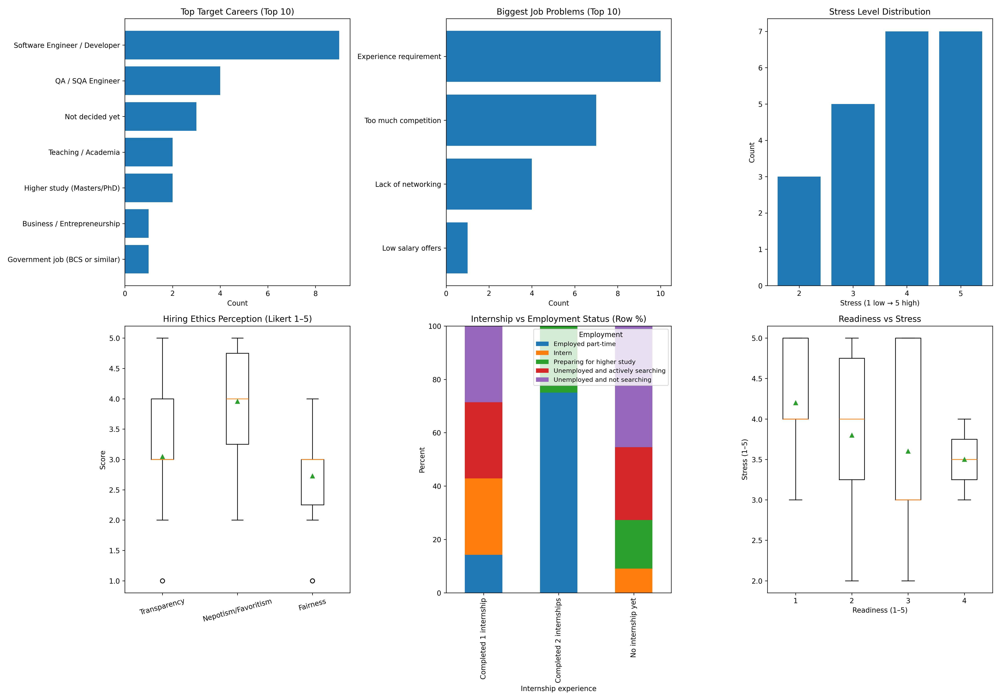
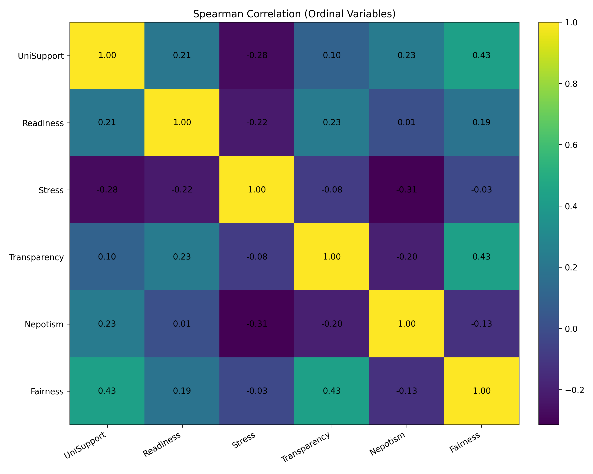
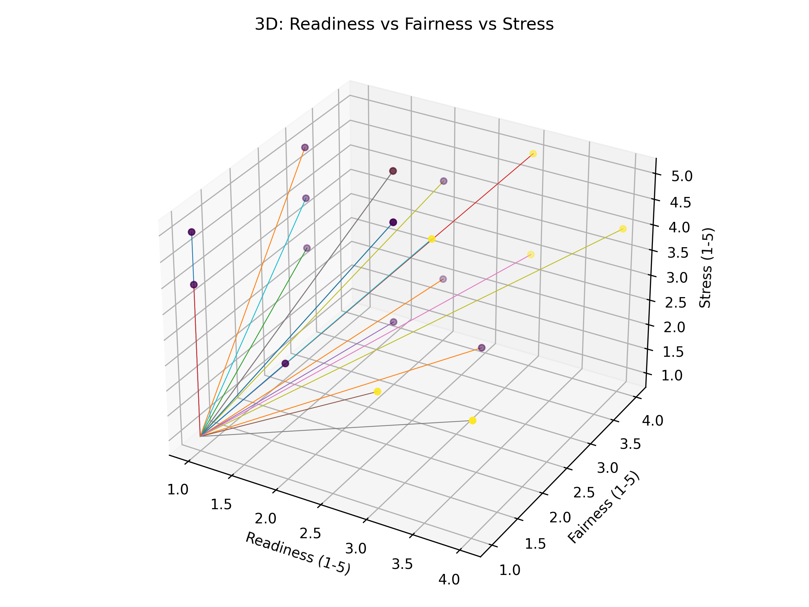
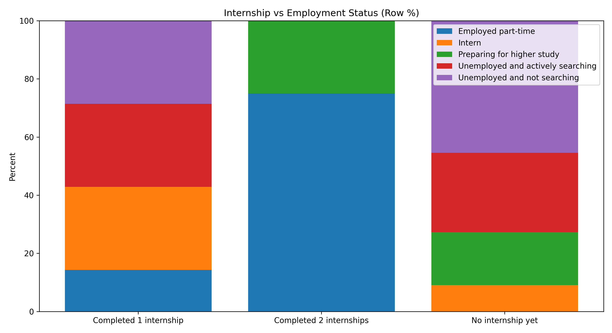
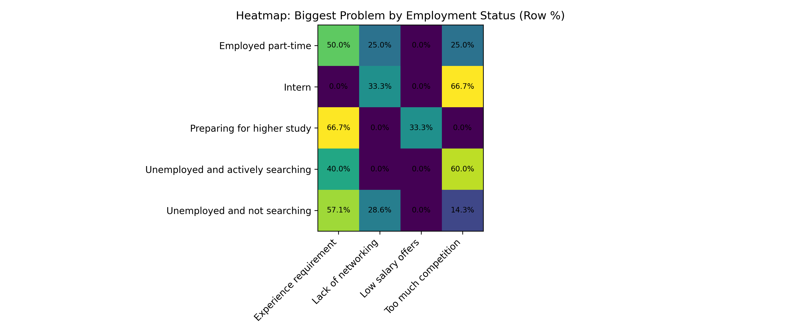

# Career, Employment, and Hiring Ethics Survey (Checkpoint 3)

This repo contains a full pipeline for a survey-based study on:
- career choice drivers
- employment challenges after graduation
- hiring ethics perceptions (fairness, transparency, nepotism)

It reads the dataset, cleans it, then generates:
- cleaned CSV
- frequency tables
- stats tests (Chi-square, Spearman)
- paper-ready figures (PNG)
- interactive 3D plot (HTML)
- a metrics summary JSON

## Project snapshot (Checkpoint 3)
- Raw rows: 23
- Discarded (no consent): 1
- Clean rows used: 22

Key stats from `outputs/metrics/metrics.json`:
- Chi-square (internship vs employment): chi2 = 15.5709, p = 0.04895, dof = 8
- Spearman (readiness vs stress): rho = -0.2188, p = 0.3279

## Why this study exists (research gap)
Many works study employability or hiring ethics separately.
This project builds one combined dataset that captures:
- career choice decision drivers
- graduate job market barriers
- perceived ethical issues in recruitment

Then it produces consistent analysis artifacts that can go directly into a paper.

## Repository structure

If your repo root is `RESEARCH/`, it looks like this:

    RESEARCH/
      src/                     # pipeline code
      scripts/                 # helper scripts
      data/
        raw/
          dataset.xlsx         # optional local dataset fallback
      outputs/
        cleaned.csv
        discarded_rows.csv
        figures/
        tables/
        metrics/
      models/                  # trained model artifacts (if produced)
      requirements.txt
      clear_outputs.bat
      .gitignore
      README.md

## Dataset sources
This project can read data in two ways:

1. Live Google Sheet (default)
   - It uses public CSV export URLs inside `src/config.py`.
   - This is useful if you keep collecting responses via Google Forms.

2. Local file fallback
   - Put your dataset here:
     `data/raw/dataset.xlsx`

If live reading fails, it automatically falls back to the local Excel.

## Setup

### 1) Create a virtual environment (recommended)

- #### Windows PowerShell:

```cmd
python -m venv .venv
```
```cmd
.venv\Scripts\activate
```
```cmd
pip install -r requirements.txt
```
    
- #### macOS/Linux:
```cmd
python3 -m venv .venv
```
```cmd
source .venv/bin/activate
```
```cmd
pip install -r requirements.txt
```

### 2) (Optional) Print raw dataset columns

    python scripts/print_columns.py

## Run (one command)
From the project root:
```cmd
python -m src.run
```

Default behavior in Checkpoint 3:
- runs all targets and all models
- generates plots
- generates 3D plot (PNG + HTML)
- runs ablation
- shows figures in PyCharm (if detected)

### Run only one target/model (optional)
```cmd
python -m src.run --target employed_binary --model rf
```
```cmd
python -m src.run --target stress_level --model logreg
```
```cmd
python -m src.run --target employment_status_multiclass --model rf
```

### Turn off parts (optional)
```cmd
python -m src.run --no-plots
```
```cmd
python -m src.run --no-3d
```
```cmd
python -m src.run --no-ablation
```

### Show figures even outside PyCharm (optional)
```cmd
python -m src.run --show
```

### Do not show figures even in PyCharm (optional)
```cmd
python -m src.run --no-show
```

## Outputs you will get

### Cleaned data
- `outputs/cleaned.csv`
- `outputs/discarded_rows.csv`

### Tables (CSV)
- `outputs/tables/freq_*.csv`
- `outputs/tables/chi_internship_vs_employment.csv`

### Metrics (JSON and CSV)
- `outputs/metrics/metrics.json`
- `outputs/metrics/ablation_*.csv`

### Figures (paper-ready PNG + interactive HTML)
All figures are saved in `outputs/figures/`.

Main figures (Checkpoint 3):
- `outputs/figures/dashboard_summary.png`
- `outputs/figures/ordinal_spearman_heatmap.png`
- `outputs/figures/3d_scatter_readiness_fairness_stress.png`
- `outputs/figures/3d_scatter_readiness_fairness_stress.html`
- `outputs/figures/internship_vs_employment.png`
- `outputs/figures/heatmap_problem_vs_employment.png`
- `outputs/figures/scatter_matrix_ordinal.png`
- `outputs/figures/ablation_f1_plot.png`

## Figures preview (from outputs/)

Dashboard summary:



Ordinal Spearman heatmap:



3D scatter (static image):



3D scatter (interactive):
- Open this file in a browser:
  `outputs/figures/3d_scatter_readiness_fairness_stress.html`

Internship vs employment:



Problem vs employment heatmap:



## Clearing outputs (Windows)
This deletes everything inside `outputs/`:

    clear_outputs.bat

## Important GitHub note (so images show in README)
If your `.gitignore` currently ignores `outputs/` fully, GitHub will not show images in this README.

Recommended `.gitignore` change.

Replace this:

    outputs/
    models/

With this:

    # keep most outputs ignored
    outputs/*
    models/*

    # but keep paper artifacts
    !outputs/figures/
    !outputs/figures/*.png
    !outputs/figures/*.html
    !outputs/tables/
    !outputs/tables/*.csv
    !outputs/metrics/
    !outputs/metrics/*.json
    !outputs/metrics/*.csv

Also we did not commit:
- `.venv/`
- `.idea/`

## Suggested next steps (to strengthen the paper)
- Increase sample size (more form responses)
- Re-run pipeline and compare changes in:
  - ethics distributions
  - internship vs employment association
  - correlations among ordinal variables
- Only claim ML model performance after dataset is large enough.
  Small data causes unstable CV and holdout splits.

## Author
Sudipta Kumar Das  
Email: dip.kumar020@gmail.com
